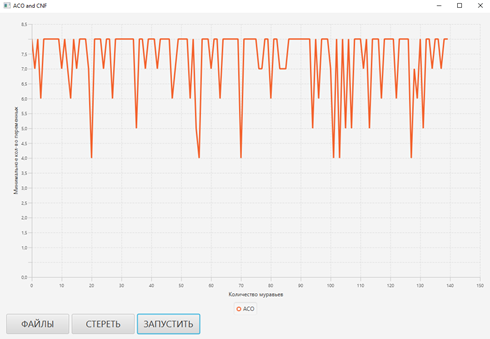

# 🐜 Алгоритм муравьиной колонии для КНФ

## 📖 О проекте

В данной работе была рассмотрена задача о **выполнимости КНФ** и применен метод решения данной задачи с использованием **алгоритма муравьиной колонии**.
Алгоритм реализован на языке **Java** с использованием библиотеки **JavaFX**.

